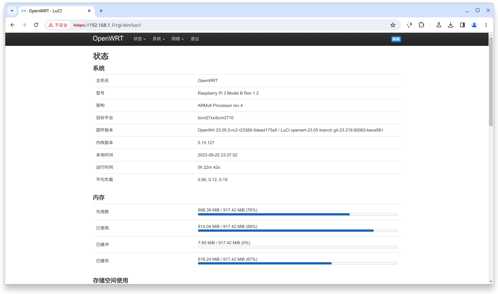
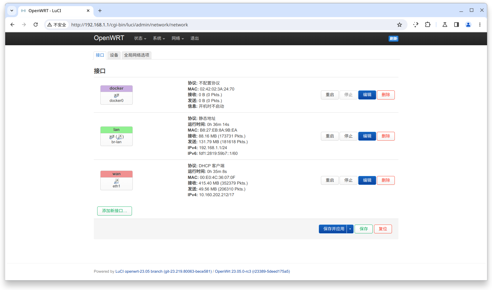

# ESurfingDialer
[](https://github.com/Rsplwe/ESurfingDialer/blob/main/LICENSE)

广东电信天翼校园（ZSM验证）登入认证客户端

### 运行环境
* Java 23 及以上
* x86_64 或 ARMv8
* glibc (linux only)
* 内存 ≥ 200M

### 使用
```bash
java -jar client.jar -u <用户名/手机号> -p <密码>
````

### 详细部署教程
[ESurfingDialerTutorial](https://github.com/EricZhou05/ESurfingDialerTutorial)

### OpenWrt 部署
目前仅支持 x86_64 及 ARMv8 架构运行。

默认 OpenWRT 环境为 musl 运行时，请使用安装 Docker 软件包部署。当以 Docker 运行时，请包含 `--network host` 参数

推荐容器：amazoncorretto:23




```bash
docker build -t dialer .
docker run -itd -e DIALER_USER=<用户名/手机号> -e DIALER_PASSWORD=<密码> --name dialer-client --network host --restart=always dialer
```

Dockerfile
```dockerfile
FROM amazoncorretto:23
WORKDIR /app
COPY run.sh /app
COPY client.jar /app
CMD ["./run.sh"]
```
run.sh
```bash
#!/bin/sh
java -jar client.jar -u ${DIALER_USER} -p ${DIALER_PASSWORD}
```


### 构建
需要 Java 版本 >= 23
```bash
./gradlew shadowJar
```
